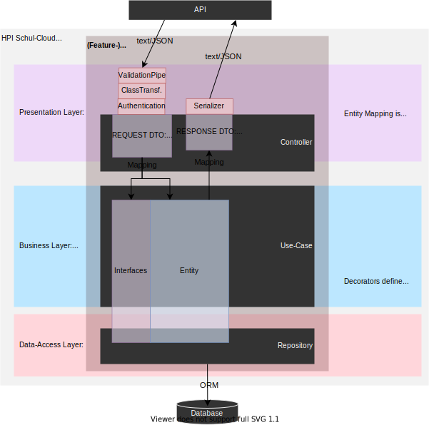

# Architecture mapping to Code

## Conventions

### Programming Conventions

#### Programming principles

This project should try following the...

- Object-Oriented Programming Basics
- Object-Oriented Programming Design Principles (composition > inheritance, referring to abstractions, SOLID Principles)
- General Design Principles (YAGNI, KISS, DRY)

#### Domain driven design

While [DDD](https://khalilstemmler.com/articles/domain-driven-design-intro/) is not enforced, we still try to follow its goals:

- Discover the domain model by interacting with domain experts and agreeing upon a common set of terms to refer to processes, actors and any other phenomenon that occurs in the domain.
- Take those newly discovered terms and embed them in the code, creating a rich domain model that reflects the actual living, breathing business and it's rules.
- Protect that domain model from all the other technical intricacies involved in creating a web application.

#### 3 layer architecture

For the 3-layer architecture this means we have to protect the business layer and domain models from the outside world and infrastructure to keep it clean, fast, testable, ready for changes.

#### Concepts

Beside Concepts NestJS introduces, own services like [repositories](https://khalilstemmler.com/articles/domain-driven-design-intro/#Repository) might be created. We prefer using use-cases to step in the application over CRUD.

#### Domain Services

Domain Services (logic which depends on multiple entities, think about a state machine) are most often executed by application layer Application Services / Use Cases. Because Domain Services are a part of the Domain Layer and adhere to the dependency rule, Domain Services aren't allowed to depend on infrastructure layer concerns like Repositories to get access to the domain entities that they interact with. Application Services fetch the necessary entities, then pass them to domain services to run allow them to interact.

Sample: Within of a use case we not depend on a user context from outside while for logging, error handling or in a repository it might be used. Like we see in the clean architecture schema.

 "The Clean Architecture from the golden Uncle Bob archives"

#### Domain events

Events have to be handled very carefully. Like hooks around services might lead into separating the business logic into independend untestable workflows, the events task and data must be defined clearly and should only be used for independent tasks.

### File structure

The server app located in `/apps/server` is structured like. Beside each ts-file, a test file _.spec.ts has to be added for unit tests (hidden for simplification). Use index.ts files that combine a folders content and export all files from within of the folder using `export _ from './file'` where this makes sense. When there are naming conflicts, use more specific names and correct concepts. Think about not to create sub-folders, when only one concept exist.

```js
src/ // sourcecode & unit tests
    - config/  // for global definitions
    - modules/ // for your NestJS modules
        - [module] // where [module] could be like user, homework, school
            - entity/
                - <entity>.entity.ts // (where <entity> might be a user, news, ... owned by the module) exports entity class & document type
                - <related-info>.entity.ts // where related-info is a partial of another entity used in the entity above
                - index.ts // exports all entities
            - controller/ // where controllers define the api
                - dto/ // dto's define api in/out types as a class with annotations
                    - <action->[param|query].ts // (like create-user-param.ts or pagination.query)
                    - <data->[response].ts // (like create-user-response.ts)
                    - index.ts // exports all dto's
                - <module>.controller.ts // defines rest api, references main service file
                - <other>.controller.ts // think about a new module when require multiple controllers :)
            - repo/ // repositories take care to load/persist/... entities
                - schema/ // contains schema imports from legacy app or new definitions (might be replaced by OR mapper)
                    - <entity>.schema.ts // exports (legacy-) mongoose schemas
                - <entity>.repo.ts // where entity might be user, news, school
            - service/ // for technical dependencies (libraries, infrastructure layer concerns)
                - <module>.service.ts // the modules main service file, might be exported for other modules
                - <other>.service.ts // use services not for features
            - mapper/
                - <entity>.mapper.ts // mapper for a domain entity, should contain mapDomainToResponse and mapFooToDomain
            - uc/ // preferred for features
                - <login-user>.uc.ts // one file per single use case (use a long name)
            - <module>.module.ts // DI instructions to build the module
    - shared/ // reused stuff without module ownership
        - core/ // shared concepts (decorators, pipes, guards, errors, ...) folders might be added
        - domain // (abstract) domain base entities which will be extended in the modules
        - util/ // helpers, tools, utils can be located here (but find a better name)
test/ // e2e tests against controllers should use same folder names like controllers

```

For concepts (see https://docs.nestjs.com/first-steps) of NestJS put implementations in shared/core. You might use shared/utils for own solutions, assume TextUtils but when it contains text validators, move it better to shared/validators/text.validator.ts before merge. The core concepts of NestJS can be extended with ours (like repo).

### File naming conventions

In TypeScript files: for Classes we use `PascalCase` (names start with uppercase letter), variables use lowercase for the first letter `camelCase`.

When assigning names, they may end with a concept name:

- A Concept might be a known term which is widely used. Samples from NestJS: Controller, Provider, Module, Middleware, Exception, Pipe, Guard, Interceptor.

- Beside we have own concepts like comparator, validator (generic ones should not be part of a modules (and located in shared folder btw) or repo, use-case which might be owned by a module.

In file names, we use lowercase and minus in the beginning and end with `.<concept>.ts`

#### Samples

| File name               | Class name        | Concept    | Location          |
| ----------------------- | ----------------- | ---------- | ----------------- |
| login-user.uc.ts        | LoginUserUc       | use case   | module/uc         |
| text.validator.ts       | TextValidator     | validator  | shared/validators |
| user.repo.ts            | UserRepo          | repository | module/repo       |
| parse-object-id.pipe.ts | ParseObjectIdPipe | pipe       | shared/pipes      |

## Layered Architecture

The different layers use separately defined objects that must be mapped when crossing layers.

- Never export entities through the service layer without DTO-mapping which is defined in the controller
- Concepts owned by a layer must not be shared with other layers



Further reading: https://khalilstemmler.com/articles/software-design-architecture/organizing-app-logic/

### Service Layer

A modules service layer is defined within of [controllers](https://docs.nestjs.com/controllers).

The main responsibilities of a controller is to define the REST API interface as openAPI specification and map DTO's to match the logic layers interfaces.

```TypeScript
	@Post()
	async create(@CurrentUser() currentUser: ICurrentUser, @Body() params: CreateNewsParams): Promise<NewsResponse> {
		const news = await this.newsUc.create(
			currentUser.userId,
			currentUser.schoolId,
			NewsMapper.mapCreateNewsToDomain(params)
		);
		const dto = NewsMapper.mapToResponse(news);
		return dto;
	}
```

#### JWT-Authentication

For **authentication**, use [guards](https://docs.nestjs.com/guards) like JwtAuthGuard. It can be applied to a whole controller or a single controller method only. Then, [ICurrentUser](/apps/server/src/modules/authentication/interface/jwt-payload.ts) can be injected using the `@CurrentUser()` decorator.

#### Validation

Global settings of the core-module ensure **request/response validation** against the api definition. Simple input types might additionally use a custom [pipe](https://docs.nestjs.com/pipes) while for complex types injected as query/body are validated by default when parsed as DTO class.

#### File naming

Complex input DTOs are defined like [create-news].param.ts (class-name: CreateNewsParam) or [pagination].query.ts (class-name: PaginationQuery)

When DTO's are shared between multiple modules, locate them in the layer-related shared folder.

> **Security:** When exporting data, internal entities must be mapped to a response DTO class named like [news].response.dto. The mapping ensures which data of internal entities are exported.

#### openAPI specification

Defining the request/response DTOs in a controller will define the openAPI specification automatically. Additional [validation rules](https://docs.nestjs.com/techniques/validation) and [openAPI definitions](https://docs.nestjs.com/openapi/decorators) can be added using decorators. For simplification, openAPI decorators should define a type and if a property is required, while additional decorators can be used from class-validator to validate content.

#### Mapping

It is forbidden, to directly pass a DTO to a use-case or return an Entity (or other use-case result) via REST. In-between a mapper must transform the given data, to protect the logic layer from outside implications.

The use of a mapper gives us the guarantee, that

- no additional data beside the known properties is published.
  - A plain object might contain more properties than defined in TS-interfaces.
    Sample: All school properties are published while only name & id are intended to be published.
- the API definition is complete

#### Testing

To test the setup behind a controller, use e2e-tests to ensure, use cases and repositories below are correctly mounted and available at a specific path.

> A controller unit test should ensure it responds with the correct data-format and a referenced use-case is called correctly.

> Authentication and response codes can be unit tested.

> Do not test logic (from the business layer or repository) in e2e-tests, this must be done where the logic is defined within of a unit test. A e2e test should only ensure everything is correctly initialized.

> Do not put logic (beside mapping) inside a controller, use the logic layer instead. Mapping can be unit tested.

### Logic (Domain-) Layer

The domain layer assumes a kind of higher-level policy that everything else relies on ([Source](https://khalilstemmler.com/articles/software-design-architecture/organizing-app-logic/)).

> This means, a controller or a repository must fit this layer.
> Specific goals of a repository, like query optimization must not be part of this layer, a repository must handle this transparent for a use case.

#### Use Cases

Use cases either return entities (data) to the user through a query (CRUD) or apply a command (do ... ok/err).
Further reading: https://khalilstemmler.com/articles/oop-design-principles/command-query-separation/

#### Testing

Use unit-tests to ensure a use-cases logic matches the given requirements (from a [user-]story). A unit test should cover preconditions, allowed input, the result, and expected exceptions defined by the story, and roughly what happens on malformed input (the execution should stop).

### Data access Layer

The data access layer consists of repositories. A repository takes care to persist domain entities defined in the business layer. As we use decorators in entities to define how they are persisted, they are used in this layer too. The repository does not need to map entities like in the presentation layer as it maps data from/to an external system into the domain and to be used from/in the business layer.

> It's not the task of the business layer to fit a repository. A respository should give the logic layer the ability to persist/make available what is defined in the logic layer. The domain model must be independent from a repository (See Clean Architecture).

Specific concepts from within of this layer must be hidden for the business layer like database queries, protocol specifics, mapping to data layer. Others like putting multiple persistence rules into transactions is part of the domain layer (while how a transaction is implemented, then is part of the data access layer).

#### Testing

For the data access layer, integration tests can be used to check the repositories base functionality against a database.

For Queries care DRY principle, they should be tested very carefully.

> Use a in-memory database for testing to allow parallel test execution and have isolated execution of tests. A test must define the before and after state of the data set clearly and cleanup the database after execution to the before state. Instead of using predefined data sets, all preconditions should be defined in code through fixtures.

Logic should not be part of a repository, use logic layer instead.
