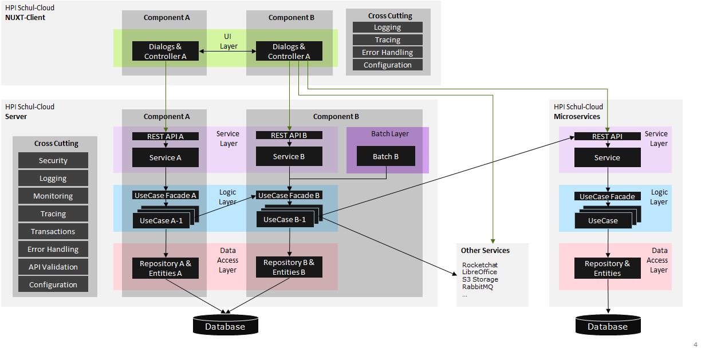
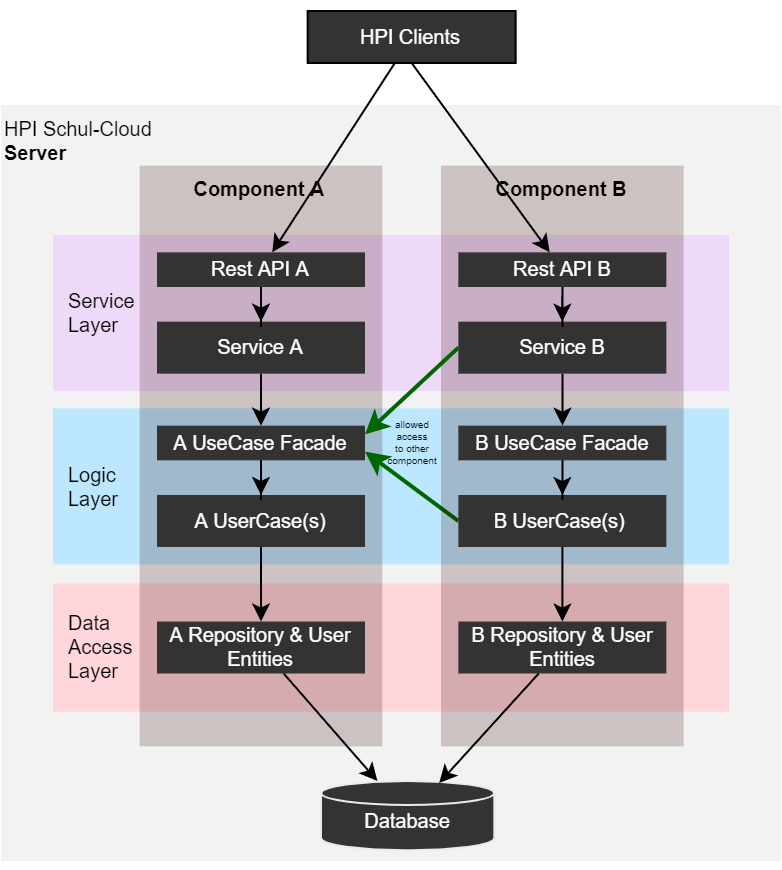
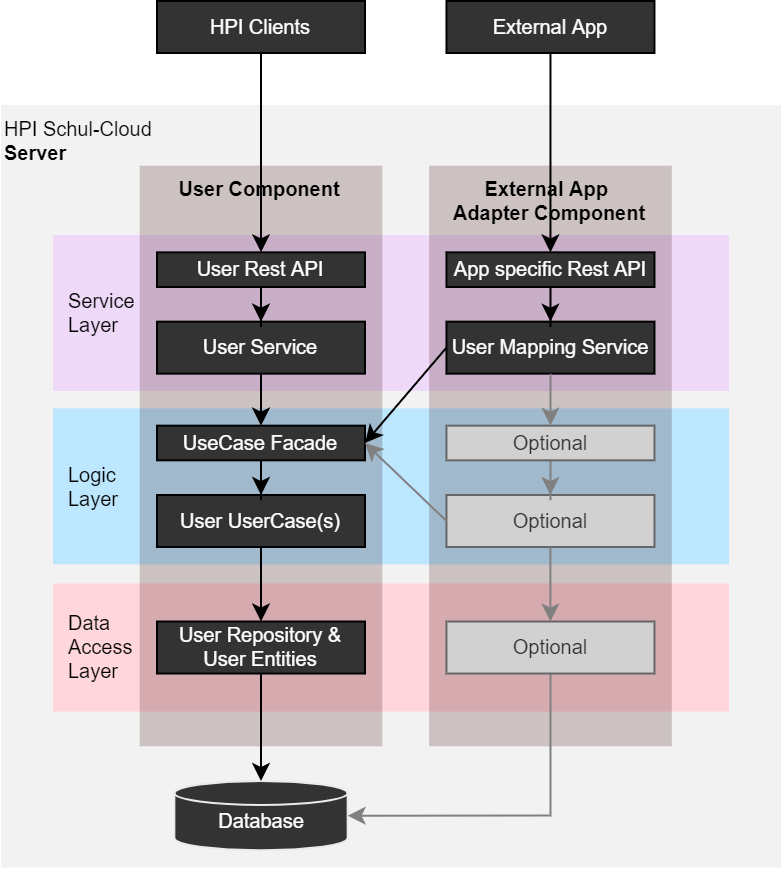
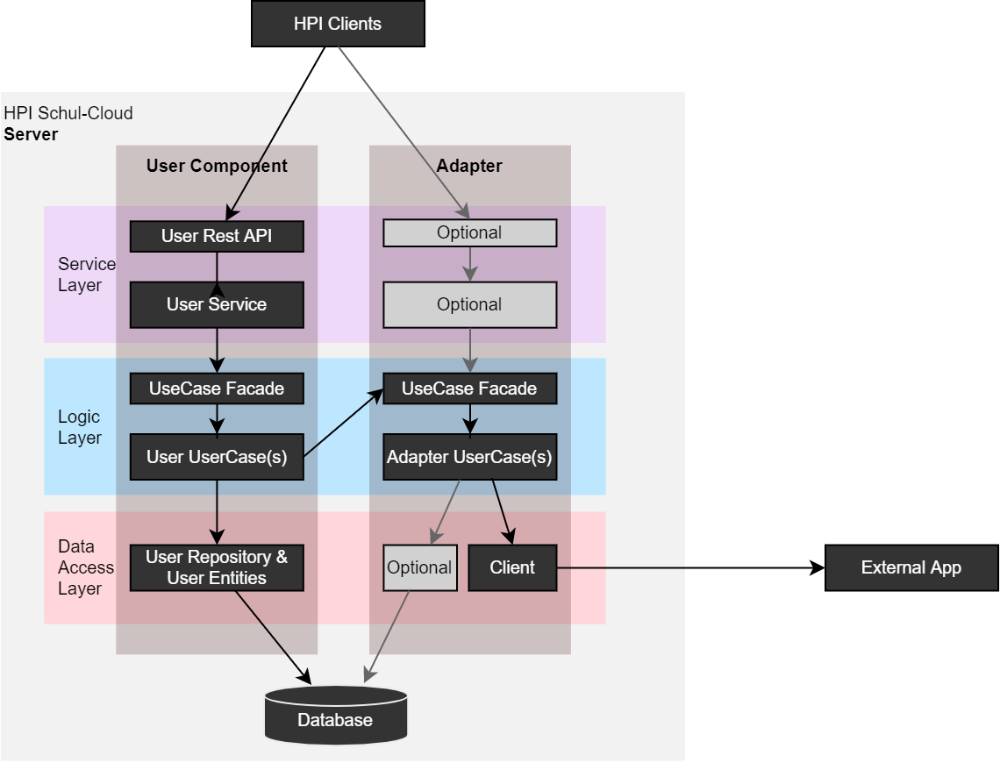
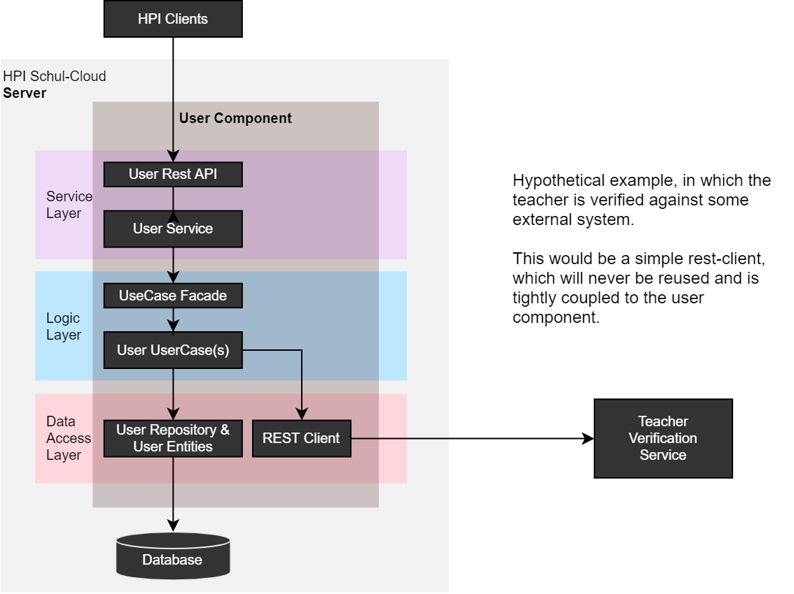
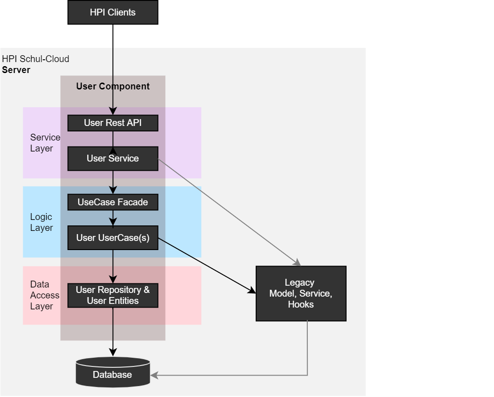
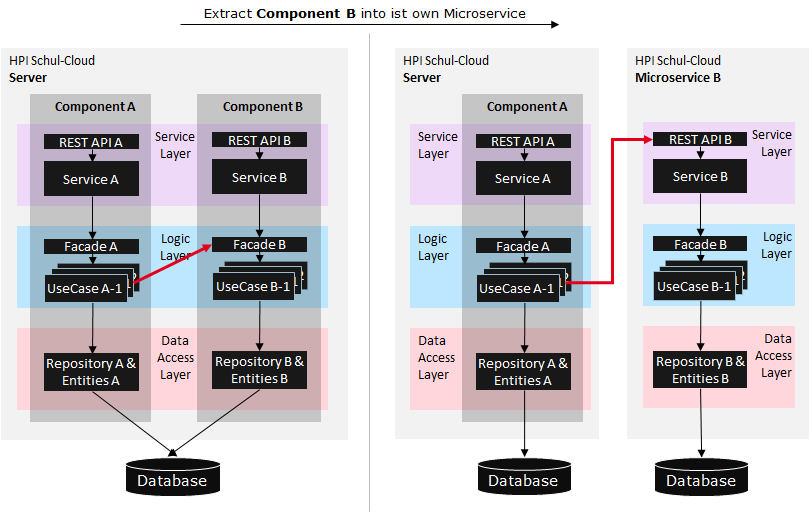
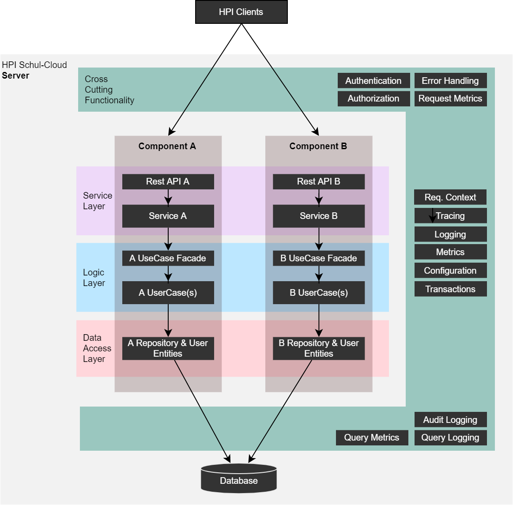

# Software Architecture

## Goals

Our architecture aims to achieve the following goals:

- decouple the business logic from any protocol, framework or technology specific code
  - makes business code easier to understand and test
  - makes code easier to maintain and change
- Define standard solutions for cross-cutting-concerns and implement them once, for example:
  - error handling
  - logging
  - transaction handling
  - API documentation and validation

## Principles

Our architecture is based on the following principles:

- **Component Oriented Design**\
  We follow a strictly component oriented design to address the following sub-principles:
  - **Separation of Concerns**
  - **Reusability** and avoiding redundant code
  - I**nformation Hiding** via component API and its exchangeable implementation treated as secret.
  - **Design by Contract** for self-contained, descriptive, and stable component APIs.
  - **Layering** as well as separation of business logic from technical code for better maintenance.
  - **Data Sovereignty** (and high cohesion with low coupling) says that a component is responsible for its data and changes to this data shall only happen via the component. Otherwise maintenance problems will arise to ensure that data remains consistent. Therefore interfaces of a component that may be used by other components are designed call-by-value and not call-by-reference.
- **Homogeneity**\
  Solve similar problems in similar ways and establish a uniform code-style.

## Overview

The following figure shows the general architecture approach for the HPI-Schul-Cloud. It contains two different architecture categories (*business architecture* and *technical architecture*), which are described in more detail bellow.

### Business Architecture

The *business architecture* divides the application into *business components*. A **business component has a well-defined responsibility that it encapsulates**. All aspects related to that responsibility have to be implemented within that business component. Further the business architecture defines the dependencies between the business components. These dependencies need to be free of cycles. A business component exports his functionality via well-defined interfaces as a self-contained API. A business component may use another business component via its API and compliant with the dependencies defined by the business architecture.

The business components in the architecture should be the output of the [business architecture](https://docs.hpi-schul-cloud.org/display/PROD/Facharchitektur) created and managed by the product owner and it must stay aligned with the implementation to provide actual value. If their components are hard to implement (e.g. because technically, there is a very high cohesion between two components), the business component model should be changed. The business architecture has a very high impact on the solution and should therefore (especially in a agile environment) be the result of a mix team (business and development).

The application might contain components, which are not part of the business architecture, but have a technical background (e.g. a complex adapter component used to connect to an external system).

### Technical Architecture

The *technical architecture* **divides the application into technical \*\*\***layers*\*\* based on the multilayered architecture. A layer is a unit of code with the same category such as service or presentation logic. A layer is therefore often supported by a technical framework. Each business component can therefore be split into *component parts\* for each layer.

## Components

Following **separation-of-concerns** we divide an application into components using our folder-conventions and the architecture-mapping (see [Architecture Mapping to Code](https://docs.hpi-schul-cloud.org/display/TSC/Software+Architecture#SoftwareArchitecture-architecturemapping)). Components must use the UseCase-Facade of other components to communicate with them. Never access any other code from a different component directly.

For the HPI Schul-Cloud, we have two major types of components

### Business Components

These usually manage one or more entities and provide the related business logic to other components and external systems.

### Adapter Components

Adapter components encapsulate interactions with external systems:

- requests **to** an **external system** like a chat system, microservices etc.
- requests **from** **external systems**, but only if:
  - the external system needs a specific API (e.g. a public standard for user/class management)
  - there are other (non-)functional requirements, which make it reasonable to encapsulate the interface into its own component, for example:
    - a reporting API, which aggregates data of multiple components
    - APIs, which have different security requirements
  - Otherwise, the standard API provided by business components should be used

## How to use Components

### Communication between components

If `component B` needs anything from `component A`, it must always access it using the UseCase Facade of A. The general rules are:

- Only the logic exposed in the UseCase facade can be invoked by other components. All other logic must not be called directly. This provides a clean and defined interface, which can be tested and validated.

  - accessing the datalayer directly would heavily impact maintainability and encapsulation
  - accessing the service layer makes no sense because it contains protocol specific aspects and overhead, which is not relevant within the application

- In some cases, it is reasonable for the service layer of `component B` to call the UseCase facade of `component A` directly
  - for example if `component B` has no business logic (like a simple adapter component)
    - In any other situation, you should only put it into the

### Provide dedicated APIs for external systems

If external applications can't use the default REST API of the system (e.g. because they expect application specific endpoints), those endpoints are provided as a separate component. For example, if an external MyLearningApp Application want's to connect to the HPI Schul-Cloud, create a new component called "MyLearningAppAdapter", which maps the external requests from the app to the internal datamodel and calls the use-case facade. Additional Hints:

- Do not access the Service Layer, the Data-Access Layer or the actual data in the database of the target component from this adapter component. Only access the UseCase-Facade. By doing this, we ensure that there are no side-effects introduced and the logic layer has full control over the business logic/rules.
- The adapter component can contain it's own logic layer, if there is actual logic related to providing the interface (e.g more complex mapping and validation rules).
- The adapter component can also contain a data-access layer, which for example caches data for the responses, contains mapping rules or buffers data from requests for processing.
  - Do not use any relations, constraints or other dependencies onto the target component(s) on database level and do not query the data directly. Always use the UseCase Facade
- An adapter component can contain multiple endpoints (e.g. for users, courses and classes) and the adapter is allowed to access multiple business components (e.g. to retrieve data from users, courses and classes).

 The figure above shows the generic setup. As stated above, the adapter component can access additional components

### Accessing an external API / System

Usually, access to an external system should be encapsulated in it's own component. This adapter component is responsible for the mapping between the internal and external datamodel and all the protocol and system specific logic. The guidelines are:

- In many cases, external system specific logic is encapsulated in it's own adapter component
  - The component should have an abstract name, e.g. instead of "RocketChatAdapter", it should be "ChatAdapter". That way, we reduce the amount of changes in the code, if we replace the system.
- There are cases, in which the client to an external system could be part of a business component. Thats allowed, if the following conditons are true:
  1.  It will not be reused/called directly by other components. All calls must go through this business components usecase facade and obviously, the logic must fit into the components responsibility.
  2.  it's very simple or tightly related to an entity managed by the business component, e.g.
      - if course content is not stored in a database but in a third party LMS. In that case, the external system is the actual "repository" of the data and the client for it belongs in the dataaccess layer
      - a component managing addresses could contain a client which calls an external application to validate addresses.
- an adapter component provides a business interface (use case oriented)
- adapter components can provide their own REST API / service layer, but don't have to
  - provided APIs should also be business oriented and not system specific
- the actual client and protocol logic (rest client, etc.) is located in the dataaccess layer
  - An adapter component can contain multiple clients for different services (e.g. rocketchat and matrixchat)
  - If a framework encapsulates the protocol specific logic enough, the framework can be used as "dataaccess layer"
- The dataaccess layer can also contain entites and db repositories. This might be the case if the adapter component caches or buffers data or needs to manage mapping master data/rules
- the logic layer is usually rather empty and contains only mapping and data-enrichment logic
  - It can also contain logic to determine the correct dataaccess-layer-client (e.g. if bundesland=x, use rocketchat, otherwise use matrix chat)

Scenarios:

#### With Adapter Component

#### With Business Component

### Access Legacy Code

If you need to access legacy code (not yet migrated to the new architecture), you can do it from the logic layer (preferred) or the service layer (if there is no logic layer or it is only needed for service-layer-mapping)

### Extract Component into external system (Microservice)

The component approach not only increases the maintainability and test-ability by a large amount, it also allows to extract components into separate applications without large refactorings. The components are already decoupled and the required functionality in the UseCase Facade can be pulled up into the REST-API.

## Layers

### UI Layer

The UI layer is implemented as single-page-application using the <https://nuxtjs.org/> framework, which wraps the <https://vuejs.org/> framework. It should contain only logic related to:

- presentation
- simple form validation
- localization

The client architecture uses an atomic design approach. For details, please check the client-architecture documentation.

### Service Layer

The service layer is responsible for exposing functionality made available by the logical layer to **external consumers **over a network via technical protocols. By doing this, it decouples the logic layer completely from any protocols or frameworks used to provide logic to the outside world. The service layer can actually contain multiple services for all kinds of protocols (e.g. REST, Sockets, Kafka Messages and so on), which all map protocol specific requests to the protocol-independent logic layer.

The service layer in the project uses the feathers/express framework to expose RESTful/socket APIs to the legacy client and NUXT client as well as any other authorized consumer.

The layer ensures that the API specification contract is fulfilled, but also handles a large set of cross-cutting-concerns. Its most important tasks are:

- Ensure authentication, authorization ((Student-,Teacher-,Admin-)Role/Permissions only)
- Request/Response validation against the API specification
- Mapping form the internal data model to the external view (e.g. remove security critical information, technical keys etc.)
- Provide old versions of an API and map to the new business logic (this is not always possible in the service layer)
- Global error handling i.e. translates Application Exception into protocol specific errors
- Capture trace-information (e.g. request-id, user) and provide them to the application for logging
- collect monitoring information (e.g. number of requests, response times, error rates etc)
- Request/response/error logging

Cross-cutting-concerns are actually shared across all components (hence the name), but many of them are hooked ([aspect oriented programming](https://en.wikipedia.org/wiki/Aspect-oriented_programming)) around the services in the service-layer und some need a service-specific configuration. For example, a hook, which does role based authorization, is implemented only once and wraps all services. But it needs to know which roles must be checked for specific services and service operations.

### Logic Layer

The logic layer is the heart of the application and contains the main business logic. According to our business architecture we divide an application into components, which contains use-cases. Each component provides a usecase facade, which can be used to trigger the business logic for a use case from either:

- the service layer
- from another component.

The logic layer is responsible for the implementation of the business logic according to the specified functional demands and requirements. It therefore creates the actual value of the application. The following additional aspects are also in its responsibility:

- **Validation** based on business rules. For example:
  - Parents must provide their consent for students bellow 16 years of age
- **Authorization** and data access rights (scope or user specific permission), for example:
  - A teacher are not allowed to see courses or students from other schools
- **Choreography**: In general, only the logic layer is allowed to call other components or trigger a call to an external system. Exceptions are possible (e.g. if a component has no business logic and therefore no logic layer)

The service layer must be free from protocol or database specific code and does not make assumptions about which protocol or client called it or where the data is stored. For example:

- the die business layer must not access any HTTP-request parameters or headers directly. It has a defined interface which contains the data independently from the caller.
- it does not throw HTTP specific errors like 404 NotFound. Instead it throws an application specific error, which is mapped to 404 by the general REST API ErrorHandler
- It does not create SQL or mongoDB queries. Instead it calls a defined interface and the dataaccess layer transform the input parameters into a DB specific query.

Using this approach, the business layer, which contains the actual logic, is much easier to test, understand and change. For example, it is possible to write xUnit Tests with no dependencies to DBs or protocols.

### Dataaccess Layer

The data-access layer is responsible for all outgoing connections to access and process data. This is mainly about accessing data from a persistent data-store but also about invoking external services. It provides a more or less business oriented interface - e.g. `findUser(userId)`- and translates it into an database or database-framework specific query. No matter which database, database framework or protocol-client you use, the interface of the dataaccess layer should be neutral. That means that your interface must also provide parameters for pagination etc.

This approach brings a couple of benefits:

- Separation of Concerns: encapsulates DB queries/requests to external services and allows for testing it separately
- Introduces an abstraction over DB/protocol Connector/framework
- Separates DB-specific Query Language and Application Specific Search Criteria
- Increases security level - the DB is not exposed via Rest API, minimizes chance for Non-SQL/SQL-Injections

### Batch Layer

The batch layer is basically a service layer, which contains code related to batch processing (bulk-oriented, non-interactive, typically long running execution of tasks). For simplicity the term batch or batch job is used for such tasks in the project.

The batch layer is responsible for batch processes, whereas the business logic is implemented in the logic layer. Compared to the service layer you may understand the batch layer just as a different way of accessing the business logic. Batches should invoke use cases in the logic layer for doing their work. Only "batch specific" technical aspects should be implemented in the batch layer. Example: For a batch, which imports user data from a CSV file, this means that all code for actually reading and parsing the CSV input file is implemented in the batch layer. The batch calls the use case "create user" in the logic layer for actually creating the users for each line read from the CSV input file.

In practice it is not always appropriate to create use cases in the logic layer for every bit of work a batch should do. Instead, the data access layer can be used directly. An example for that is a typical batch for data retention which deletes out-of-time data. Often deleting out-dated data is done by invoking a single SQL statement. It is appropriate to implement that SQL in a Repository method (provided by the dataaccess layer interface) and call this method directly from the batch. But be careful that this pattern is a simplification which could lead to business logic cluttered in different layers which reduces maintainability of the application. It is a typical design decision you have to take when designing your specific batches.

## Cross Cutting Concerns

### Error Handling

An important part of the layered architecture is the handling of errors. In our architecture, errors should either be:

- handled directly (e.g. retry a failed REST-API-Call after a timeout error occurred)
- Bubble up un-catched to the generic error handler in the cross cutting concerns layer (which , which knows how to map this error to an external error and return it to the caller.
  - In case of batch jobs, the batch layer catches the error and knows how to handle it (e.g. restart a job, skip a part of the job, stop the job completely etc).

Please check the [error handling guidelines](https://docs.hpi-schul-cloud.org/display/TSC/Error+Handling+Guildelines) for details.

### Transaction Handling

Transactions can span multiple layers and components. A concept is necessary to execute/rollback those transactions.

TODO: add a link to the concept and describe how it interacts with layers.

### Request Context

Multiple crosscutting concerns make it necessary to introduce a "request context". This is a set of request specific variables accessible everywhere within the application during a request. For example:

- each request will contain a request-specific trace id, which must be added to log messages and audit log entries
- each request is triggered by a user or a batch job. We need to store this trigger in the audit logs
- if we introduce transactions across multiple components (e.g. users and classes), we need a way to share transaction information between components and store the transaction until a commit

Because this context is required in all layers (especially in the data access layer for audit logging) and in cross cutting hooks, we need a framework/feature, which makes this available for direct access without adding this object to every method signature as input variable. Luckily, the necessary functionality is now part of nodejs: [AsyncLocalStorage](https://nodejs.org/docs/latest-v14.x/api/async_hooks.html#async_hooks_class_asynclocalstorage).

The general approach for rest requests:

1.  A request is received
2.  A hook initializes the request context
3.  A hook extracts trace information (e.g. traceid and spanid) from the request and adds it to the request context
4.  A hook authenticates and authorizes the user and stores basic user information (e.g. user id, maybe general permissions roles) in the request context
    - If the user is not authenticated, a "guest user" is set in the content with only guest permissions
    - For batch jobs, a technial user must be set in the request context. For the business logic, the technology, channel and user must be hidden behind the request context.
5.  The normal code is executed and can access the request context
    - If the business logic needs data from the request context, it can access it
    - cross cutting logic like audit logging can extract the information. E.g. before the data access layer writes a entity change to the database, it retrieves the trace id and the user id from the request context and adds these information to the entity
    - If we make a call to another service (e.g. calendar), we retrieve the trace id from the request context and add it to the outgoing request
    - Our logging abstraction retrieves the trace id from the request context and adds it to the log message before writing it to the logfile (actually the console).
6.  After the response is sent to the client, the request context is "destroyed"

Characteristics of the context:

- It is request specific and destroyed after the request is processed
- Data in it are only accessable by the processing o f a specific request, not any other request of the same user or another user!
- It should only contain very basic information necessary for cross cutting concerns like logging and audit logging. Do not use it to transport all kinds of business data around

**Important:** In order to make the code (and especially the business logic) agnostic to the source of a request, the request context should be considered a "invocation context". That means that also batch jobs (time based triggerd requests) and anonymous rest request should work the exact same way. That means that:

- we must setup the request context for batch jobs
- we need technical users for anonymous requests and batch jobs
- super users (super heroes) must use the same mechanisms as normal users (no special permission checks etc)

That way, we can use the same logic for all invocations and the source of an invocation is isolated within the service layer.

### Logging and Tracing

For details see the corresponding [logging and tracing guidelines](https://docs.hpi-schul-cloud.org/display/TSC/Logging+and+Tracing+Guidelines).

# Architecture Mapping to Code

## For details about how this architecture is implemented in code, see the [Server Code Conventions](https://docs.hpi-schul-cloud.org/display/TSC/Server+Code+Conventions).

## Business Layer

---

The business layer defines the core of our application. It defines logic in use-cases and holds the domain model in entities.

> Protect that domain model from all the other technical intricacies involved in creating a web application.

This means: the business layer must focus on the logical view of the application. Surrounding layers must be implemented on the busines layer.

### Entities

The domain entities are defined in the business layer. They might have [ORM-decorators](https://mikro-orm.io/docs/decorators) which define how entities are persisted.

- DTOs are exported to the business layer only
- Entities/Documents rely on the Schema below and refer to a value object that is referenced by an id

Never export an entity without DTO conversion to the upper layer.

TODO: When convert to a DTO take care this might change the interface but the objects data must be filtered too (Solution: Mapper)!

## Presentation Layer

Controllers are used to connect the application to the presentation layer, which provides a REST API. All data a controller retrieves or responds over the API have to be defined as DTO class. It must enforce Mapping incoming and outgoing data to DTO instances and apply [Validation](https://docs.nestjs.com/techniques/validation) and [Authentication]() using [Pipes](https://docs.nestjs.com/pipes).

Data Flow:

- Incoming Data: API -> Validation -> Authentication -> DTO
- Outgoing Data: DTO -> Serialization -> API

Models with ownership:

- DTO for request and response models

## Data Layer

Before access data, a repository has to be implemented which is responsible to separate for example a database provider from the application.
