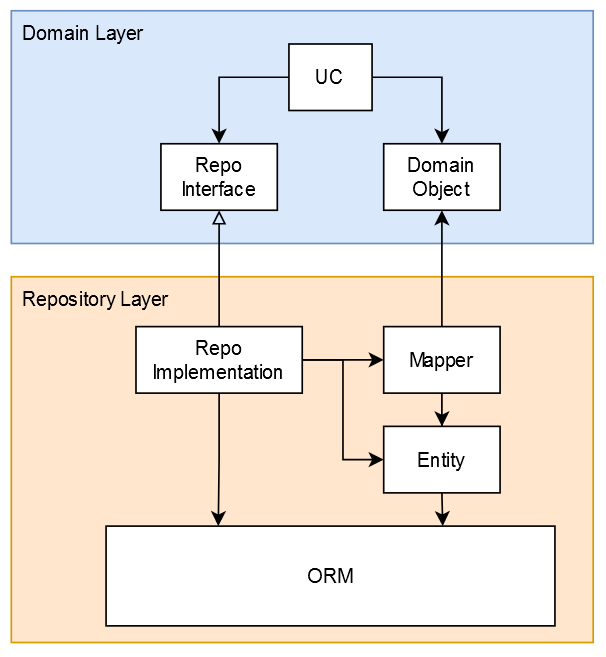

# Software Architecture

## Goals

Our architecture aims to achieve the following goals:

- Maintainability
  - it should be easy as possible to make changes that do not change the behaviour of the system (refactoring)
  - it should be easy to exchange entire components of the system, without impact on other components.
- Extendability
  - it should be easy to add new functionality to the system
- Agility
  - it should be easy to react to changing requirements during our development process
- Change Security
- it should be easy to determine the correctness of the system after making any changes

## Principles

In order to achieve these goals, we try to follow the principles detailed below.
These principles apply to all layers of our software, from lines of code and methods to modules and architectural layers.

- **Single Responsibility / Seperation of Concerns**
  - each piece of code should have a single layer of abstraction/detail
  - each piece of code should have a single reason to change
- **Open/Closed Principle**
  - design to be open to extension, but closed to modification
  - **Liskov Substitution**
  - the specific input may be more generic than its interface
  - the specific output may be more specialized than its interface
- **Interface Segregation**
  - multiple small interfaces are preferred over big interfaces
- **Dependency Inversion Principle**
  - always depend on interfaces, not implementations
  - higher level parts should not depend on lower level parts.
- **Keep It Simple (KISS)**
  - any piece of code should be simple and readable
  - any logic should be broken down to be trivial
  - beware of overenginiering and premature optimisation
- **You Aint Gonna Need It (YAGNI)**
  - keep decisions open for as long as possible
  - build only what you need to build, stay flexible for future requirements
- **Do Not Repeat Yourself (DRY)**
  - do not solve the same responsability or concern in multiple places
  - beware of things that look similar, but are not. for example, things that change for different reasons should not be combined, even if their code looks the same

## Server Layer Architecture

We generally distinguish three different layers in our server architecture: The API Layer, the Repository Layer, and the Domain Layer.


Note that based on the Dependency Inversion Principle, the Domain Layer does not have any dependencies. Instead, both the API and Repository Layer depend on its abstractions.

### Domain Layer

The Domain Layer contains the business logic of the application. As mentioned above, it is not allowed to know about anything outside the domain layer itself.


Any operation within the system is defined by a *usecase (UC)*. It describes how an external actor, for example a user, can interact with the system.

Each usecase defines what needs to be done to authorize it, and what needs to be done to fulfill it. To this end, it orchestrates *services*.

A service is a public part of a domain module, that provides an interface for logic. It might be a simple class doing simple calculations, an interface to a complex hierarchy of classes within a module, or anything in between.

The domain layer might also define other classes, types, and interfaces to be used internally by its services, as well as the interface definitions for the repository layer. That way, the domain does not have to depend on the repositories, and the repositories have to depend on the domain instead (dependency inversion)

TODO: the exact way of implementing the interfaces between repositories and domain layer is still in active discussion and development within the architecture chapter

### API Layer

The API Layer is responsible for providing the API that is exposed outside the system, and to map the various incoming requests into domain DTOs.


The params.dto and response.dto are used to automatically generate the API Documentation based on openAPI. The params.dto also contains information that is used for input validation.

The controller is responsible for sanitizing and authenticating incoming requests, and to map to and from the format that the domain usecase implementations expect. To this end, mappers are being used.

### Repository Layer

The Repository Layer is responsible for outgoing requests to external services. The most prominent example is accessing the database, but the same principles apply for sending emails or other interactions with external systems.



In order to access these external systems without knowing them, the domain layer may define interfaces that describe how it would like to use external services in its own domain language. The repositories implement these interfaces, recieving and returning exclusively objects or dtos defined in the domain.

The datamodel itself is defined through Entities, that have to be mapped into domain objects before they can be returned to the domain layer. We use MikroORM to create, persist and load the entities and their references among each other.

## Modules

The codebase is broken into modules, each dealing with a part of the businesslogic, or seperated technical concerns.
These modules define what code is available where, and ensure a clean dependency graph.

All Code written should be part of exactly one module. Each module contains any services, typedefinitions, interfaces, repositories, mappers, and other files it needs internally to function.

When something is needed in more than one module, it needs to be explicitly exported by the module, to be part of its public interface. It can then be imported by other modules. Services are exported published via the dependency injection mechanism provided by Nestjs.

```js
@Module({
  providers: [InternalRepo, InternalService, PublicService],
  exports: [PublicService],
})
export class ExampleModule {}

@Module({
  imports: [ExampleModule]
  providers: [SomeOtherService],
})
export class OtherModule {}
```

Notice that in the above example, the `PublicService` can be used anywhere within the `OtherModule`, including in the `SomeOtherService`, whereas the `InternalRepo` and `InternalService` can not.

Things that cant be injectables, like types and interfaces, are exported via the index file at the root of the module.

Code that needs to be shared across many modules can either be put into their own seperate module, if there is a clearly defined seperate concern covered by it, or into the shared module if not.

### Api Modules

The controllers and the corresponding usecases, along with the api tests for these routes, are seperated into api modules

```js
@Module({
  imports: [ExampleModule]
  providers: [ExampleUc],
  controllers: [ExampleController],
})
export class ExampleApiModule {}
```

This allows us to include the domain modules in different server deployments, without each of them having all api definitions. This also means that no usecase can ever be imported, as only services are ever exported, enforcing a seperation of concerns between logic and orchestration.

## Horizontal Architecture

The application is split into different modules that implement different parts of our domain.

The exact split of modules is still work in progress, or left open as implementation detail. Some important considerations are:

- things with high cohesion and coupling should be in the same module
- things with low coupling should be in seperate modules
- the modules define an explicit public interface of usecases and types they expose to other modules
- no module should ever try to access a class of a different module that is not explicitly exported
- no injectable should ever be defined in more than one module
- a module should only export services to be used by other modules.
- a module that other modules might need to import, especially in another mikroservice, should not contain controllers.
