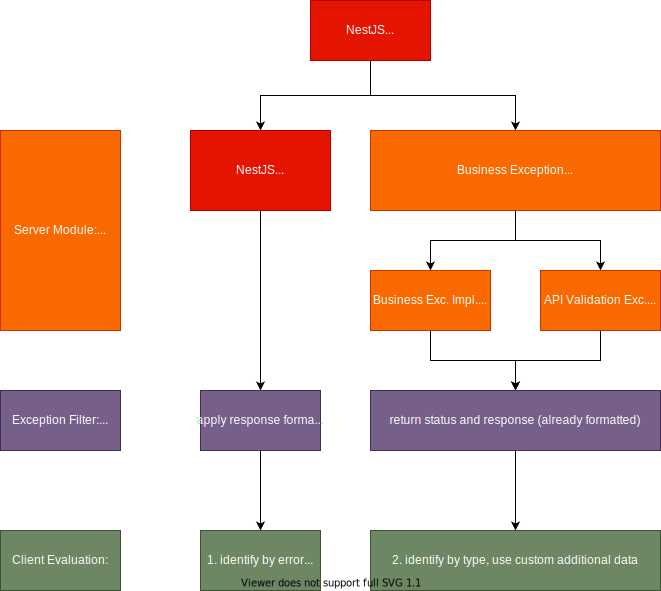

# Cross cutting concerns

The cross cutting topics are part of the core-module.

## Logging

For logging use the logger ServerLogger, provided by the logger module. It is hooked up in the application on startup, replacing the default logger and can be transient injected into any provider by additionally define set a context into the logger.

```TypeScript
// add Logger module to your feature module imports or unit tests
import { LoggerModule } from '../core/logger/logger.module';
// ...
imports: [LoggerModule],

```

```TypeScript
// within of a provider (use-case, service, ...)

// import the server logger service
import { ServerLogger } from '../core/logger/logger.service';

@Injectable()
export class YourUc {
	constructor(
		// initialize a ServerLogger
		private logger: ServerLogger
	) {
        // set the context by this class name (here: 'YourUc')
		this.logger.setContext(YourUc.name);
	}

	async sampleUcMethod(params) {
        this.logger.log(`start do something...`);
		// ...
        this.logger.log(`finished successfully to do something...`);
	}
```

This produces a logging output like

```
[Nest] NUMBER - TIME   [YourUc] start do something...
[Nest] NUMBER - TIME   [YourUc] finished successfully to do something...
```

Later we can filter the log for a single [context].

A logger does implement the LoggerService interface:

```TypeScript
interface LoggerService {
    log(message: any, context?: string): any;
    error(message: any, trace?: string, context?: string): any;
    warn(message: any, context?: string): any;
    debug?(message: any, context?: string): any;
    verbose?(message: any, context?: string): any;
}
```

Only a string should be provided as a single parameter by default. Ensure not putting complex objects into a log. Think about persisting more complex results for later analysis into a database.

Optionally in the second parameter, the context can be overridden only.

## Exception Handling



We separate our business exceptions from technical exceptions. While for technical exceptions, we use the predefined HTTPExceptions from NestJS, business exceptions inherit from abstract BusinessException.

By default, implementations of BusinessException must define

```JSON
	code: 500
	type: "CUSTOM_ERROR_TYPE",
	title: "Custom Error Type",
	message: "Human readable details",
	// additional: optionalData
```

There is a GlobalErrorFilter provided to handle exceptions, which cares about the response format of exceptions and logging. It overrides the default NestJS APP_FILTER in the core/error-module.

In client applications, for technical errors, evaluate the http-error-code, then for business exceptions, the type can be used as identifier and additional data can be evaluated.

For business errors we use 409/conflict as default to clearly have all business errors with one error code identified.

> Sample: For API validation errors, 409/Bad Request will be extended with `validationError: ValidationError[{ field: string, error: string }]` and a custom type `API_VALIDATION_ERROR`.

Pipes can be used as input validation. To get errors reported in the correct format, they can define a custom exception factory when they should produce api validation error or other exceptions, handled by clients.
