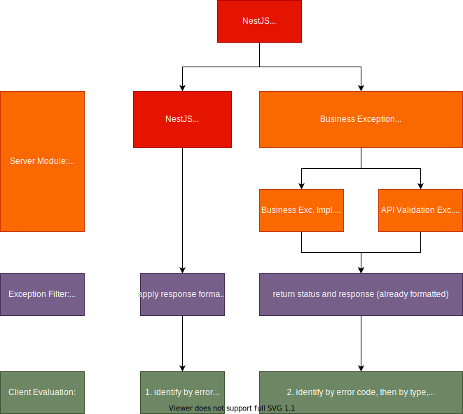

# Exception Handling



We separate our business exceptions from technical exceptions. While for technical exceptions, we use the predefined HTTPExceptions from NestJS, business exceptions inherit from abstract BusinessException.

By default, implementations of BusinessException must define

```JSON
	code: 500
	type: "CUSTOM_ERROR_TYPE",
	title: "Custom Error Type",
	message: "Human readable details",
	// additional: optionalData
```

There is a GlobalErrorFilter provided to handle exceptions, which cares about the response format of exceptions and logging. It overrides the default NestJS APP_FILTER in the core/error-module.

In client applications, for technical errors, evaluate the http-error-code, then for business exceptions, the type can be used as identifier and additional data can be evaluated.

For business errors we use 409/conflict as default to clearly have all business errors with one error code identified.

> Sample: For API validation errors, 400/Bad Request will be extended with `validationError: ValidationError[{ field: string, error: string }]` and a custom type `API_VALIDATION_ERROR`.

Pipes can be used as input validation. To get errors reported in the correct format, they can define a custom exception factory when they should produce api validation error or other exceptions, handled by clients.
