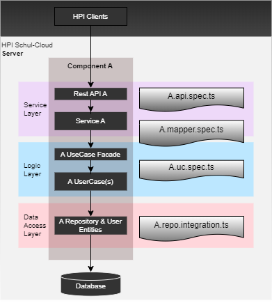

# Testing

Automated testing is the essential part of the software development process.
It improves the code quality and ensure that the code operates correctly especially after refactoring.

## The Different Tests



Our goal is to test each application layer mostly independent of others.

- **Repo tests** operate on data access layer.
  They prove that the database queries are executed correctly.
- **Use case tests** operate on logic layer.
  They verify the correct implementation of the business requirements.
- **Mapper tests** operate between logic and service layer.
  They verify the correct mapping between domain objects and objects delivered to the clients via REST API.
- **End-to-end tests** operate on all layers of the application.
  The testing endpoint is the service layer. These tests verify the availability of the expected endpoints and checks
  the expected status codes and the structure of the received objects.

## General Test Conventions

### Lean Tests

The tests should be as simple to read and understand as possible. They should be effortless to write and change, in order to not slow down development. Wherever possible:

- avoid complex logic
- cover only one case per test
- only use clearly named and widely used helper functions
- stick to blackbox testing: think about the unit from the outside, not its inner workings.
- its okay to duplicate code for each test

### Naming Convention

When a test fails, the name of the test is the first hint to the developer (or any other person) to what went wrong where. (along with the "describe" blocks the test is in).
Thus, your describe structure and testcase names should be designed to enable a person unfamiliar with the code to identify the problem as fast as possible. It should tell him:

- what component is being tested
- under what condition
- the expected outcome

To facilitate this, your tests should be wrapped in at least two describe levels.

```TypeScript
// Name of the unit under test
describe("Course Service", (() => {
    // a "when..." sentence
	describe("When a student tries to create a course", (() => {
		// a "should..." sentence
        it("should fail", async () => {
            ...
        });
    });
});
```

### Handling of function return values

When assigning a value to an expect, separate the function call from the expectation to simplify debugging. This later helps when you not know about the return value type or if it's an promise or not. This is good style not only for tests.

```TypeScript
	// doSomethingCrazy : retValue
	it('bad sample', () => {
		expect(doSomethingCrazy(x,y,z)).to... 
	})
	it('good sample', () => {
		const result = doSomethingCrazy(x,y,z)
		expect(result).to... // here we can simply debug
	})

```

### Promises and Timouts in tests

When using asynchronous functions and/opr promises, results must be awaited within of an async test function instead of using promise chains. While for expexting error conditions it might be helpful to use catch for extracting a value from an expected error, in every case avoid writing long promise chains. 

 - Instead of using done callback, use async test functions. 
 - Use await instead of (long) promise chains 
 - never manually set a timeout

```TypeScript
	// doSomethingCrazy : Promise<retValue>
	it('bad async sample', async function (done) => {
		this.timeout(10000);
		return doSomethingCrazy(x,y,z).then(result=>{
			expect(result).to...
			done() // expected done
		}).catch(()=>{
			logger.info(`Could not ... ${error}`);
			done() // unexpected done, test will always succeed which is wrong
		})
	})
	it('good async sample', async () => {
		// no timeout set
		const result = await doSomethingCrazy(x,y,z)
		expect(result).to...
	})
``` 

> Timeouts must not be used, when async handling is correctly defined!

### Expecting errors in tests

When expecting an error, you might take values from an error, test for the error type thrown and must care of promises.

```TypeScript
	// doSomethingCrazy : Promise<retValue>
	it('bad async sample expecting an error', async () => {
		expect(doSomethingCrazy(x,y,z)).to...
	})
	it('good async sample expecting an error value', async () => {
		const code = await doSomethingCrazy(x,y,z).catch(err => err.code)
		expect(code).to...
	})
	it('good sample expecting an error type from a sync function', () => {
		expect(() => doSomethingCrazySync(wrong, param)).toThrow(BadRequestException);
	})
	it('good sample expecting an error type from an async function', async () => {
		await expect(doSomethingCrazySync(wrong, param)).rejects.toThrow(BadRequestException);
	})
```

### Isolation

Each test should be able to run alone, as well as together with any other tests. To ensure this, it is important that the test does not depend on any preexisting data.

- Each test should generate the data it needs, and ensure that its data is deleted afterwards. (this is usually done via mocha's "afterEach" function.
- When you create objects with fields that have to be globally unique, like the account username, you must ensure the name you choose is unique. This can be done by including a timestamp.
- Never use seeddata.

### Test Structure

Your test should be structured in three seperate areas, each distinguished by at least an empty line:

- Arrange - set up your testdata
- Act - call the function you want to test
- Assert - check the result

this is known as the AAA-pattern.

## Testing Utilities

NestJS:

- provides default tooling (such as test runner that builds an isolated module/application loader)
- provides integration with **Jest** and **Supertest** out of the box
- makes the Nest dependency injection system available in the testing environment for mocking components

The `@nestjs/testing.Test` class provides an execution context that mocks the full Nest runtime, but gives
hooks that can help to manage class instances, including mocking and overriding.

The method `Test.createTestingModule()` takes module metadata as argument it returns `TestingModule` instance.
The `TestingModule` instance provides method `compile()` which bootstraps a module with its dependencies.
Every provider can be overwritten with custom provider implementation for testing purposes.

```Typescript
  beforeAll(async () => {
      const moduleRef = await Test.createTestingModule({
          controllers: [SampleController],
          providers: [SampleService],
        }).compile();

      sampleService = moduleRef.get<SampleService>(SampleService);
      sampleController = moduleRef.get<SampleController>(CatsController);
    });
```

## Unit Tests vs Integration Tests

In Unit Tests we access directly only the layer which is currently testing.
Other layers should be mocked or are replaced with default testing implementation.
Especially the database access and database calls should be mocked.

In contrast to unit tests the integration tests use access to the database and execute
real queries using repositories.

### Repo Tests

For the data access layer, integration tests can be used to check the repositories base functionality against a database.

For Queries care DRY principle, they should be tested very carefully.

> Use a in-memory database for testing to allow parallel test execution and have isolated execution of tests.

> A test must define the before and after state of the data set clearly and cleanup the database after execution to the before state.

> Instead of using predefined data sets, all preconditions should be defined in code through fixtures.

Our repository layer uses `mikro-orm/EntityManager` to execute the queries.
By testing repositories we want to verify the correct behaviour of the repository functions.
It includes verifying expected database state after executed repository function.
Therefore, the `*.repo.integration.spec.js` should be used.

The basic structure of the repo integration test:

#### Preconditions (beforeAll):

1. Create `Nest JS testing module`:
   1.1 with `MongoMemoryDatabaseModule` defining entities which are used in tests. This will wrap MikroOrmModule.forRoot() with running a MongoDB in memory.
   1.2 provide the repo which should be tested
2. Get repo, orm and entityManager from testing module

```TypeScript
	import { MongoMemoryDatabaseModule } from '@src/modules/database';

	let repo: NewsRepo;
	let em: EntityManager;
	let testModule: TestingModule;

    beforeAll(async () => {
    	testModule: TestingModule = await Test.createTestingModule({    (1)
             imports: [
                 	MongoMemoryDatabaseModule.forRoot({                 (1.1)
					entities: [News, CourseNews, ...],
				}),
              ],
             providers: [NewsRepo],                                     (1.2)
      }).compile();
      repo = testModule.get<NewsRepo>(NewsRepo);                        (2)
      orm = testModule.get<MikroORM>(MikroORM);
      em = testModule.get<EntityManager>(EntityManager);
    })
```

#### Post conditions (afterAll), Teardown

After all tests are executed close the app and orm to release the resources by closing the test module.

```TypeScript
    afterAll(async () => {
        await testModule.close();
    });
```

> When Jest reports open handles that not have been closed, ensure all Promises are awaited and all application parts started are correctly closed.

### Mapping Tests

Mapping tests are Unit Tests which verify the correct mapping between entities and Dto objects.
These tests should not have any external dependencies to other layers like database or use cases.

### Use Case Tests

Use case tests are Unit Tests which verify the business logic of the application.
The database calls are mocked and spyied. So we can check how and with which parameters the repo functions are called.

> Use unit-tests to ensure a use-cases logic matches the given requirements (from a [user-]story).

> A unit test should cover preconditions, allowed input, the result, and expected exceptions defined by the story, and roughly what happens on malformed input (the execution should stop).

#### Preconditions

1. Create `Nest JS testing module`
2. Use `Repo` as provider reimplement the repo functions with some default implementations
3. Provide other dependencies like `AuthorizationService` and provide default implementation for the function, which are called.
4. Get repo and uc from testing module

```TypeScript
      const module: TestingModule = await Test.createTestingModule({ (1)
			imports: [LoggerModule],
			providers: [
				NewsUc,
				{
					provide: NewsRepo,                                  (2)
					useValue: {
						save() {
							...
						},
						findAll() {
							...
						},
					},
				},
				{
					provide: AuthorizationService,                      (3)
					useValue: {
						getPermittedEntities(userId, targetModel, permissions) {
							...
						},
					},
				},
			],
		}).compile();

		service = module.get<NewsUc>(NewsUc);                           (4)
		repo = module.get<NewsRepo>(NewsRepo);
```

#### Test

1. Spy repo function which is called inside the tested use case
2. Call the tested function
3. Verify that the repo spy is called with the expected functions

```Typescript
		it('should search for news by empty scope ', async () => {
			const findAllSpy = jest.spyOn(repo, 'findAll');             (1)
			await service.findAllForUser(userId, scope, pagination);    (2)
			const expectedParams = [targets, false, pagination];
			expect(findAllSpy).toHaveBeenCalledWith(...expectedParams); (3)
		});
```

## E2E Tests

Unlike unit testing, which focuses on individual modules, end-to-end testing covers the interaction between classes and
modules at a more aggregate level. Automated end-to-end tests help us to ensure that the overall behavior of the system is correct.

### Controller Tests

To test the setup behind a controller, use e2e-tests to ensure, use cases and repositories below
are correctly mounted and available at a specific path.

> A controller unit test should ensure it responds with the correct data-format and a referenced use-case is called correctly.

> Authentication and response codes can be unit tested.

> Do not test logic (from the business layer or repository) in e2e-tests, this must be done where the logic is defined within of a unit test. A e2e test should only ensure everything is correctly initialized.

> Do not put logic (beside statements, transactions, mapping) inside a controller, use the logic layer instead. 

> Mappers must be unit tested.

#### Preconditions

1. Create Nest testing module
2. Import `ServerModule` as the whole
3. Override authentication using `JwAuthGuard`
   3.1 Override authorized user with the mocked user data
4. Override other services for example for authorization
5. Create and initialize the whole Nest Application using `createNestApplication()`
6. Get Orm and Entity Manager from module

```Typescript

	beforeAll(async () => {
		const module: TestingModule = await Test.createTestingModule({  (1)
			imports: [ServerModule],                                    (2)
		})
			.overrideGuard(JwtAuthGuard)                                (3)
			.useValue({
				canActivate(context: ExecutionContext) {
					const req: Request = context.switchToHttp().getRequest();
					req.user = {                                        (3.1)
                            userId: '0000d224816abba584714c9c',
                            roles: [],
                            schoolId: '5f2987e020834114b8efd6f8',
                            accountId: '0000d225816abba584714c9d',
                    };
					return true;
				},
			})
			.overrideProvider(AuthorizationService)                     (4)
			.useValue({
				checkEntityPermissions() {},
				getEntityPermissions() {
					return ['NEWS_VIEW', 'NEWS_EDIT'];
				},
			})
			.compile();

		app = module.createNestApplication();                           (5)
		await app.init();
		orm = module.get<MikroORM>(MikroORM);                           (6)
		em = module.get<EntityManager>(EntityManager);
	});
```

#### Clean up

After Each test delete the created data in test to have a clean database for the next test.

```Typescript
	afterEach(async () => {
		await em.nativeDelete(News, {});
	});
```

#### Post Conditions

After all tests are executed close the app and orm to release the resources

```Typescript
	afterAll(async () => {
		await app.close();
		await orm.close();
	});
```

#### Test

An example e2e test uses app http server to call the tested url.
The `request()` function from the `supertest` library simulates HTTP request.
The response can be verified by checking the response code or by applying some verification to the result object.

```Typescript
	describe('GET /news', () => {
      it('should get empty response if there is no news', async () => {
        const response = await request(app.getHttpServer()).get(`/news`).expect(200);
        const {data, total} = response.body as PaginationResponse<NewsResponse[]>;
        expect(total).toBe(0);
        expect(data.length).toBe(0);
      });
    });
```

> Don't forget to test HTTP error codes as well

## References

This guide is inspired by https://github.com/goldbergyoni/javascript-testing-best-practices/
