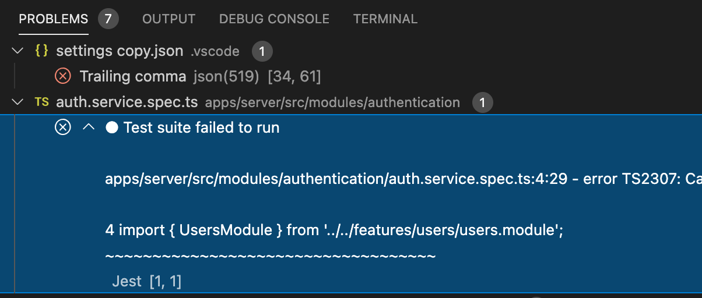
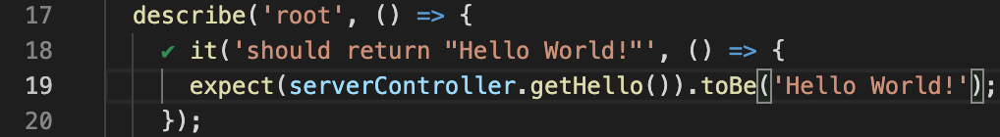

# VSCode

## Launch scripts

In the file `./vscode/launch.default.json` you find following actions:

- `Attach to NestJS` will allow to attach VSCode debugger to an already running application
- `Deubg NestJS via NPM` will start the application and attach the debugger

## Settings

## Recommended extensions

See `./vscode/extensions.json` for recommendations.

### Jest

Jest is used to care of unit- and end2end tests on all `*.spec.ts` files.

 Allows to just see failing tests in Problems tab.

 and get small icons like ✔️ or a cross beside it-definitions inside of test files.
